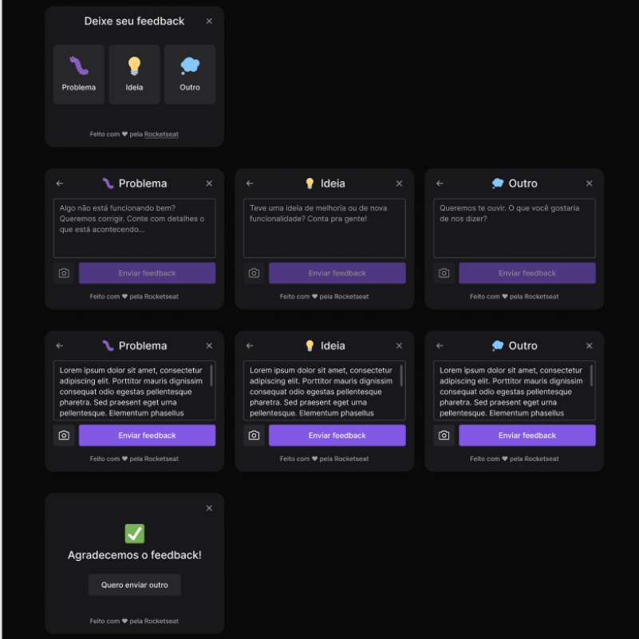
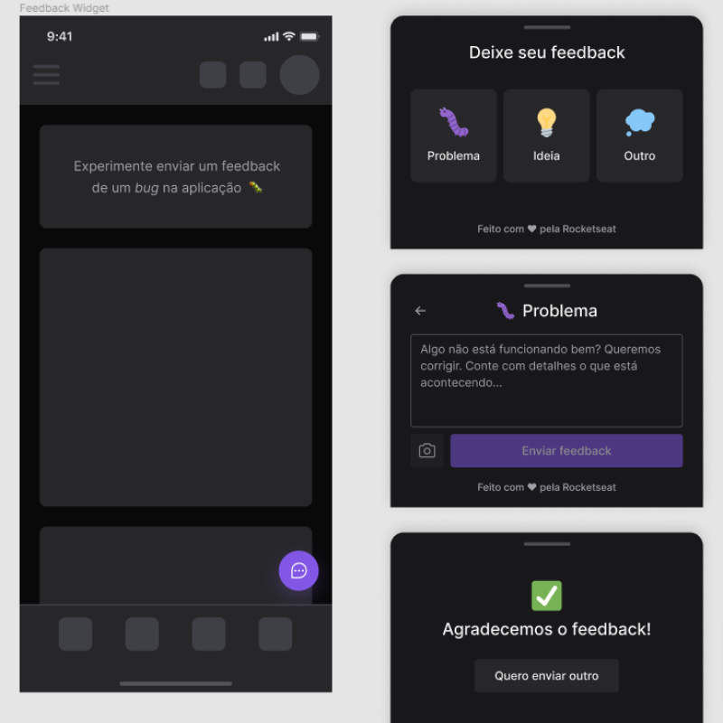

# nlw_return - Feedback Widget


Semana NLW Return, desenvolvida pela empresa Rocketseat.<br/>
<br/>
Onde construimos um widget para reportar bugs é possível inserir uma categoria, comentário e o print da  tela que a pessoa está de alguma aplicação nossa, esses bugs são reportados, para nossa api que está no seguinte repositório:

- https://github.com/moraes3000/nlw_backend


---
## Fotos


| 
| :---: | :---: |

## Tecnologias

Este projeto foi feito utilizando as seguintes tecnologias:

- [vitejs](https://vitejs.dev/guide/)
- [Typescript](https://www.typescriptlang.org/)
- [tailwindcss](https://tailwindcss.com/)
- [html2canvas](https://html2canvas.hertzen.com/documentation)
- [phosphor-react](https://phosphoricons.com/)
- [Axios](https://github.com/axios/axios)

### Tutorial de instalação

Clone o projeto

```term

git@github.com:moraes3000/nlw_return.git

```

Instale as dependências

```term

yarn

```

Rode o projeto

```term

yarn dev

```

Acesse [http://localhost:3000](http://localhost:3000/) para ver o resultado.